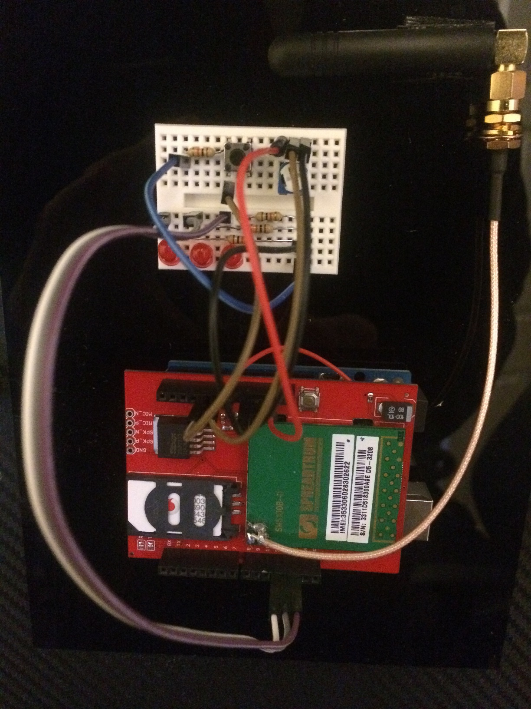
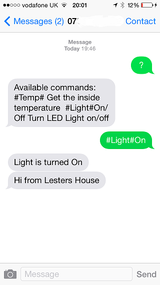

Cellular Shield Test
====================

This application is a simple test of the SparkFun Cellular Shield. It accepts the following incomming text commands:
1.	'?' - returns a text message with the list of commands
2.  '#Temp#' Get the inside temperature
3.  '#Light#On/Off' Turn the LED light on or off.

In addition, it has a button that sends a 'Hi' text when pressed.

Note
----

The Cellular Shield only works with an external 5V power supply. Also, there is a wire directly soldered from the power-supply to the Cellular Shield.

	

Screenshot showing a text dialogue (the last text is sent when you press the button on the bread-board).

	
