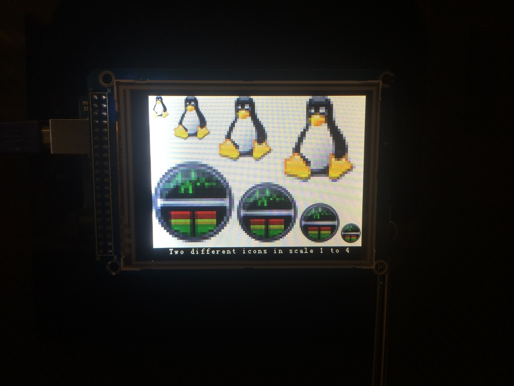

Arduino TFT Bitmap display
==========================

This application shows bitmap images on the Arcuino TFT screen. It uses the UTFT library (C)2010-2012 Henning Karlsen (http://www.henningkarlsen.com/electronics).

	