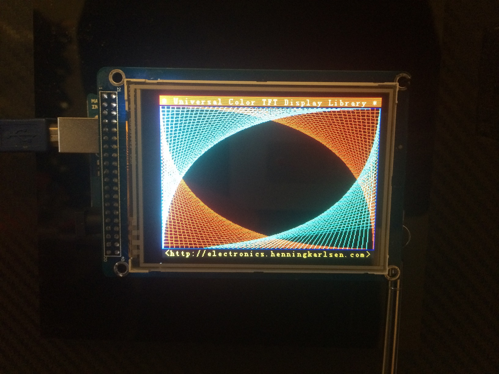
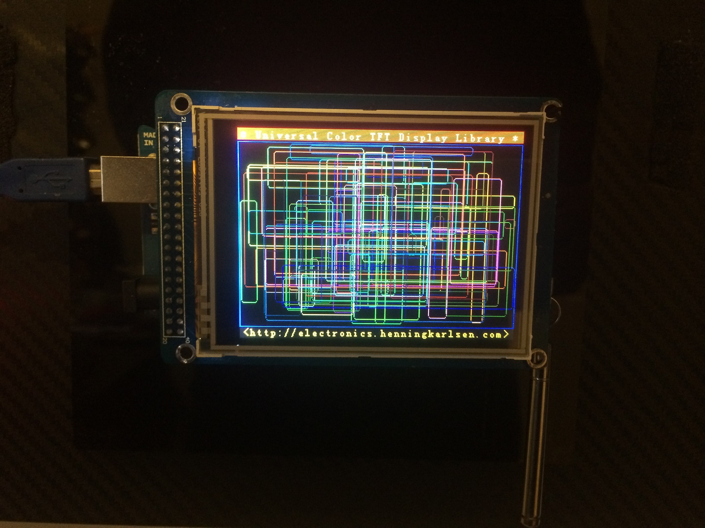
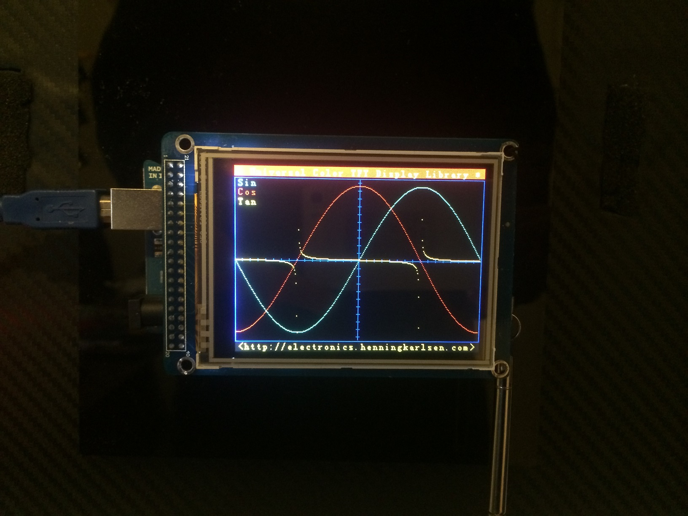
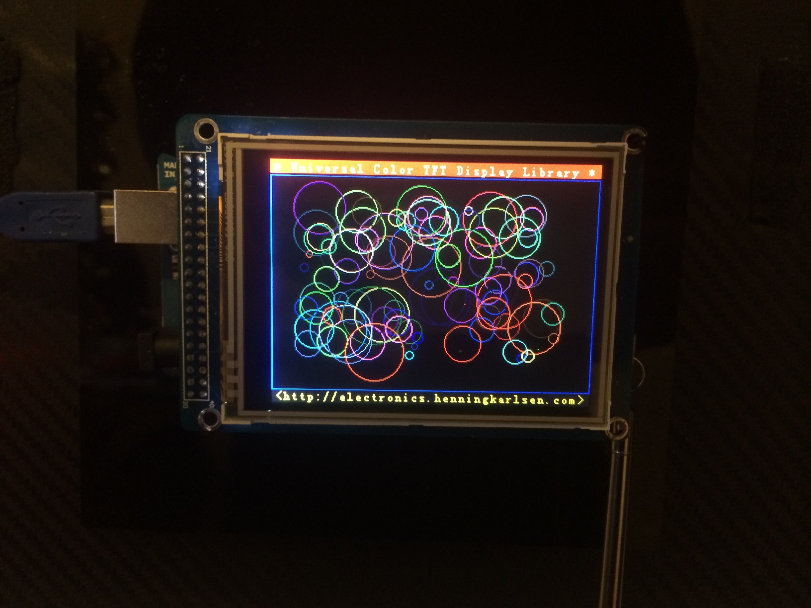

Arduino TFT Demo
================

This application shows a demo of different display techniques for the Arcuino TFT screen. It uses the UTFT library (C)2010-2012 Henning Karlsen (http://www.henningkarlsen.com/electronics).

	
	
	
	
