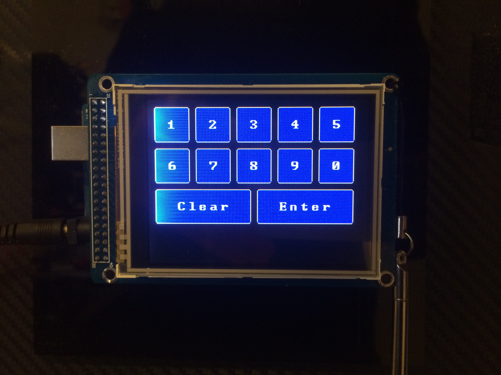

Arduino TFT Button Input
========================

This application shows a simple keypad with touch input. It uses the UTouch and UTFT libraries (C)2010-2012 Henning Karlsen (http://www.henningkarlsen.com/electronics).

	