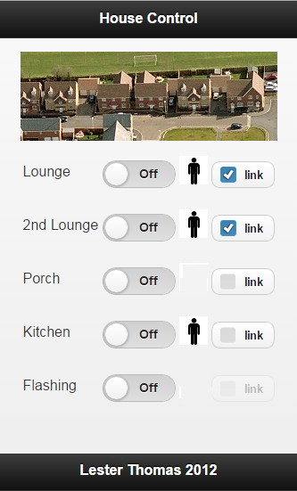

X10 house wiring interface and website Arduino application
==========================================================

This application serves a mobile-friendly web-page with access to light switches and motion detectors over a house wiring X10 interface. It requires 2 Arduinos that communicate with each other over a Serial Connection (using the EasyTransfer library). 

In my set-up an Arduino-Mega was used to interface to X10. It interfaces at a very low-level using interrupts (triggered at 50Hz at the trough of the electricity signal wave). The X10 signals are sent via a Marmitek XM10 Two Way TTL interface, that simply plugs into a wall socket. The X10 sketch is based on an <A href="https://code.google.com/p/arduino-x10/source/browse/trunk/Libraries/X10ex/?r=40">X10 Library</A> by Thomas Mittet.

The second Arduino is an Arduino-Ethernet with embeded SD card. It serves web-pages off the SD card, and also allows the web client to query for a l.json which shows the status of the rooms. It also allows the web client to send x10 commands that are forwarded over the serial connection. 

 

The wiring diagram is shown below. The pin 2 is the interrupt pin - it has a pull-high resistor to pull it up to 5V when there is no signal from the XM10 TTL plug.


The JSON response showing the status of the house is shown below. The JSON format is very minimal (I was reaching the memory limits for the Arduino - a better technology choice would be a Raspberry Pi Web Server and Arduino for the low-Level X10 integration).


```
{
"2": [1,0,0],
"3": [0,1,0],
"4": [0,0,1],
"5": [0,0,0],
"6": [0,0,0],
"7": [0,0,0]
}
```
